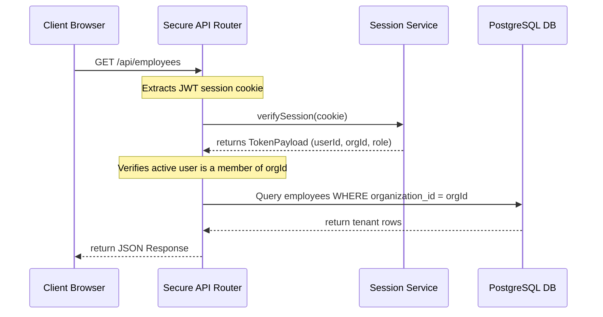

# VoiceOS Multi-Tenant Architecture & Data Security

VoiceOS is an enterprise-grade multi-tenant SaaS platform. Every tenant organization is sandboxed, preventing any cross-talk, data leaks, or unauthorized resource visibility between different companies.

---

## 🔒 1. Sandboxing Strategy: Database Level

We enforce data partitioning using a **shared database, logical isolation schema**. All data rows (from AI employees to calls and workflow logs) are tagged with an `organization_id`:

```sql
-- Every query retrieves data scoped to the active user's active organization:
SELECT * FROM ai_employees 
WHERE organization_id = $1 AND workspace_id = $2;
```

### 1.1 Key Principles of Logical Partitioning
*   **UUID Primary Keys:** Primary keys use random Version 4 UUIDs rather than auto-incrementing integers (`1, 2, 3...`). This prevents malicious actors from guessing identifiers of other organizations.
*   **Foreign Key Restraints:** Deleting an organization cascadingly deletes all its associated workspaces, memberships, AI employees, and logged call histories, facilitating GDPR compliant account removal.

---

## 🔑 2. Sandboxing Strategy: API & Authentication Level

No client browser can request data by passing raw IDs. Every API route handler performs strict validation checks against the authenticated user session:



---

## 🛡️ 3. Role-Based Access Control (RBAC) Scopes

Within an organization, access is restricted according to user roles:

| Role | Telephony / AI Configuration | Read Billing / Settings | View Audit Logs / Workflows |
| :--- | :--- | :--- | :--- |
| **Owner** | Full Admin Actions (All Workspaces) | Yes (Add/Remove members) | Yes |
| **Admin** | Full Admin Actions (All Workspaces) | Read-only | Yes |
| **Developer** | Create/Update AI Employees & Webhooks | No | Yes |
| **Operator** | Toggle Status (Draft/Active), Edit Prompts | No | Read-only |
| **Viewer** | Read-only Access (Monitor calls) | No | No |
