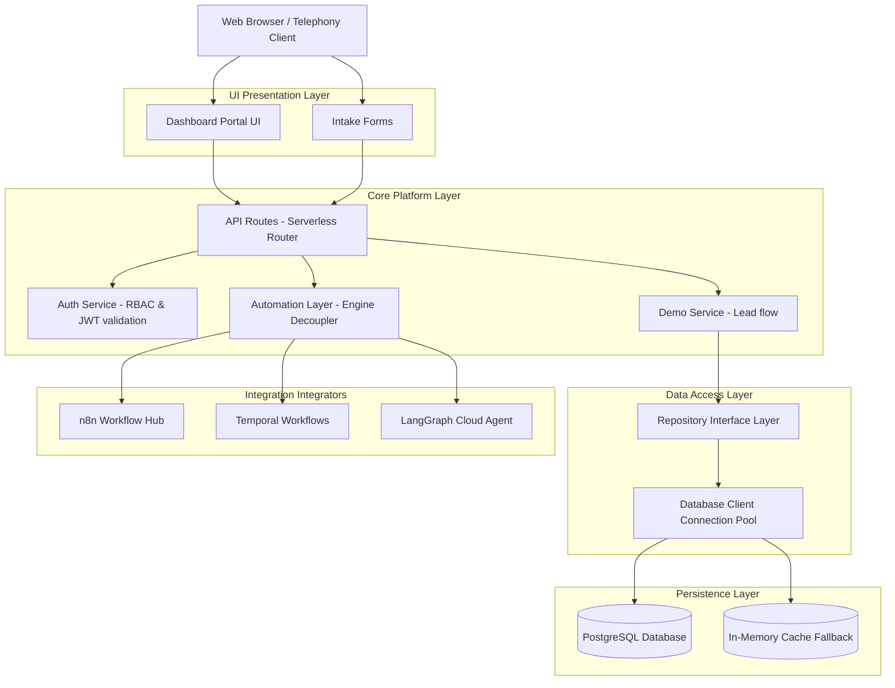

# VoiceOS System Architecture

This document details the high-level architecture, flow pipelines, and core layers of **VoiceOS** — an autonomous multi-tenant enterprise AI operating system.

---

## 🏗️ 1. Architectural Layers

VoiceOS is structured on clean architecture principles to isolate UI, logic, data schema adapters, and integrations:



---

## 🧬 2. Modular Execution Flow

Every transaction, call, or API request routes through decoupled layers:

### 2.1 Lead Intake Flow (Book Demo Example)
1.  **Client Submission:** The frontend user submits a demo request.
2.  **API Routing:** Request hits [route.ts](file:///C:/Users/tcpwa/ProjectOS/src/app/api/demo/route.ts), which conducts schema parameter check and inputs sanitization.
3.  **Data Storage:** The handler initializes [DemoRepository](file:///C:/Users/tcpwa/ProjectOS/src/repositories/demoRepository.ts) and executes `save()`. The repo writes to PostgreSQL (or Local Memory DB fallback).
4.  **Automation Dispatch:** The handler queries the `AutomationService` to trigger a workflow.
5.  **decoupled Adapter Execution:** The `AutomationService` checks configuration, determines which automation engine to run (e.g. `n8n`), and executes the HTTP payload dispatcher.
6.  **Response Return:** Status updates to `Processed` in the database, and the execution ID is returned to the client browser.

---

## 🔌 3. Future AI Employee Telephony Routing

VoiceOS is pre-structured to plug in low-latency voice pipelines. Telephony routes will connect as follows:

```text
Incoming Call (SIP/PSTN)
   ↓
Twilio / Vonage (WebSockets)
   ↓
VoiceOS Real-time Gateway (VAD & Buffer Queue)
   ↓
ASR (Speech-to-Text via Deepgram)
   ↓
LLM Agent Orchestrator (GPT-4o/Gemini) ← Dynamic context from Knowledge Store (RAG)
   ↓
TTS (Text-to-Speech via ElevenLabs/Cartesia)
   ↓
Twilio SIP Return Audio
```

This pipeline binds to `ai_employees` profiles configured in the VoiceOS SaaS dashboard and logged into the `conversation_logs` database tables.
